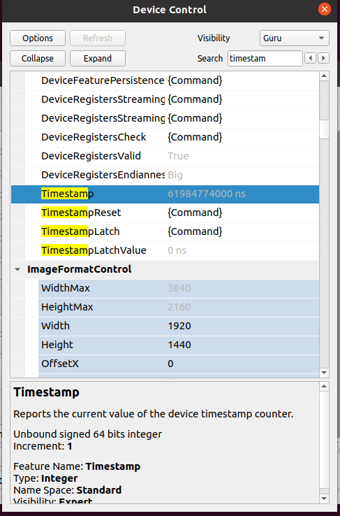
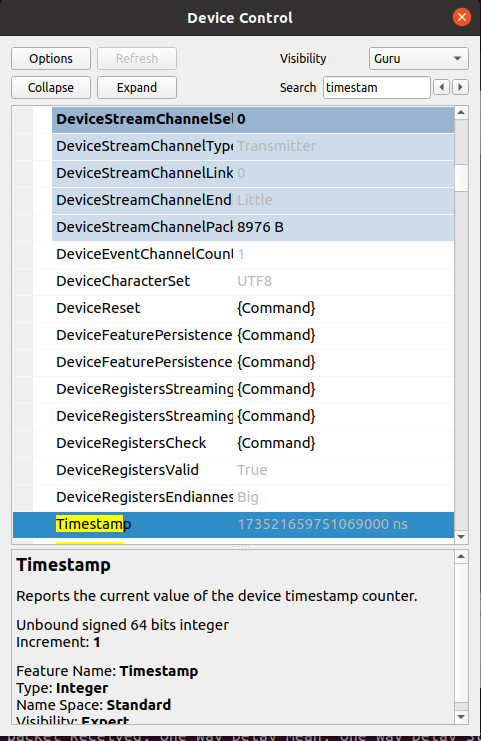

# PTPv2 (IEEE 1588-2008) recipes for Bottlenose

Bottlenose cameras support the Precision Time Protocol (PTP). This repository contains
recipes to implement a local PTP grandmaster running on a Linux system and pointers
hot to set up Windows subscribers.

## Ubuntu Linux

For Bottlenose to synchronize via PTP you need to have at least one PTP grandmaster
clock in your subnet. You buy a commercial clock source or setup a Linux machine
that provides the grandmaster clock. Please install ```ptpd```, a sample configuration
can be found [here](conf/ptpd.conf).

Sample configuration on Ubuntu 20.04:

```bash
sudo apt-get install ptpd
# Download and edit the configuration to YOUR ETHERNET DEVICE (see above)
sudo ptpd -M -V -c ptpd.conf
#Warning: global:foreground="N" : setting will be overwritten with value "Y" from command line
#Warning: global:verbose_foreground="N" : setting will be overwritten with value "Y" from command line
#2023-09-07 17:02:16.414407 ptpd2[23466].startup (warning)   (___) Unknown configuration entry: ptpengine:announce_timeout - setting will be ignored
#2023-09-07 17:02:16.414444 ptpd2[23466].startup (warning)   (___) Unknown configuration entry: ptpengine:announce_timeout_grace_period - setting will be ignored
#2023-09-07 17:02:16.414476 ptpd2[23466].startup (warning)   (___) Unknown configuration entry: ptpengine:pid_as_clock_idendity - setting will be ignored
#2023-09-07 17:02:16.414522 ptpd2[23466].startup (info)      (___) Configuration OK
#2023-09-07 17:02:16.414887 ptpd2[23466].startup (info)      (___) Successfully acquired lock on /var/run/ptpd2.lock
#2023-09-07 17:02:16.415062 ptpd2[23466].startup (notice)    (___) PTPDv2 started successfully on enx000acd38ee8a using "masteronly" preset (PID 23466)
#2023-09-07 17:02:16.415086 ptpd2[23466].startup (info)      (___) TimingService.PTP0: PTP service init
## Timestamp, State, Clock ID, One Way Delay, Offset From Master, Slave to Master, Master to Slave, Observed Drift, Last packet Received, One Way Delay Mean, One Way Delay Std Dev, Offset From Master Mean, Offset From Master Std Dev, Observed Drift Mean, Observed Drift Std Dev, raw delayMS, raw delaySM
#2023-09-07 17:02:16.415138, init,
#2023-09-07 17:02:16.416301 ptpd2[23466].enx000acd38ee8a (notice)    (lstn_init) Now in state: PTP_LISTENING
#2023-09-07 17:02:16.416325, lstn_init,  1
#2023-09-07 17:02:26.415201 ptpd2[23466].enx000acd38ee8a (notice)    (lstn_init) TimingService.PTP0: elected best TimingService
#2023-09-07 17:02:26.415288 ptpd2[23466].enx000acd38ee8a (info)      (lstn_init) TimingService.PTP0: acquired clock control
#2023-09-07 17:02:28.416616 ptpd2[23466].enx000acd38ee8a (notice)    (mst) Now in state: PTP_MASTER, Best master: 000acdfffe38ee8a(unknown)/1 (self)
#2023-09-07 17:02:28.416711, mst, 000acdfffe38ee8a(unknown)/1
```

The time server is now running for that Ethernet interface Bottlenose will synchronize to
the grandmaster clock within a few seconds. If you have an active GigE connection, it will time out as the clock 
maybe advanced by a few years. That is normal.

### Checking for Sychronization

 * Start ```eBusPlayer``` and connect to the camera
 * Select ```Device Control``` and configure the visbility to ```Guru```
 * Observe ```Timestamp```

A value within a few seconds or minutes indicates that Bottlenose is not synchronized

```
61984774000 [ns] /1e9 -> 61.98 [s] (not synchronized, time since power up)
```

A value of 5 years or more (OS Epoch) indicates that the camera is synchronized.

```
173521659751069000 [ns] /1e9/60/60/24/365 -> 5.50 [years] (synchronized, time since OS epoch)
```

## Windows

Since Windows 10 2018, Microsoft Windows has native support to operate as
ptp slave. Please follow [these instructions](https://github.com/microsoft/W32Time) 
to setup Windows clients.
